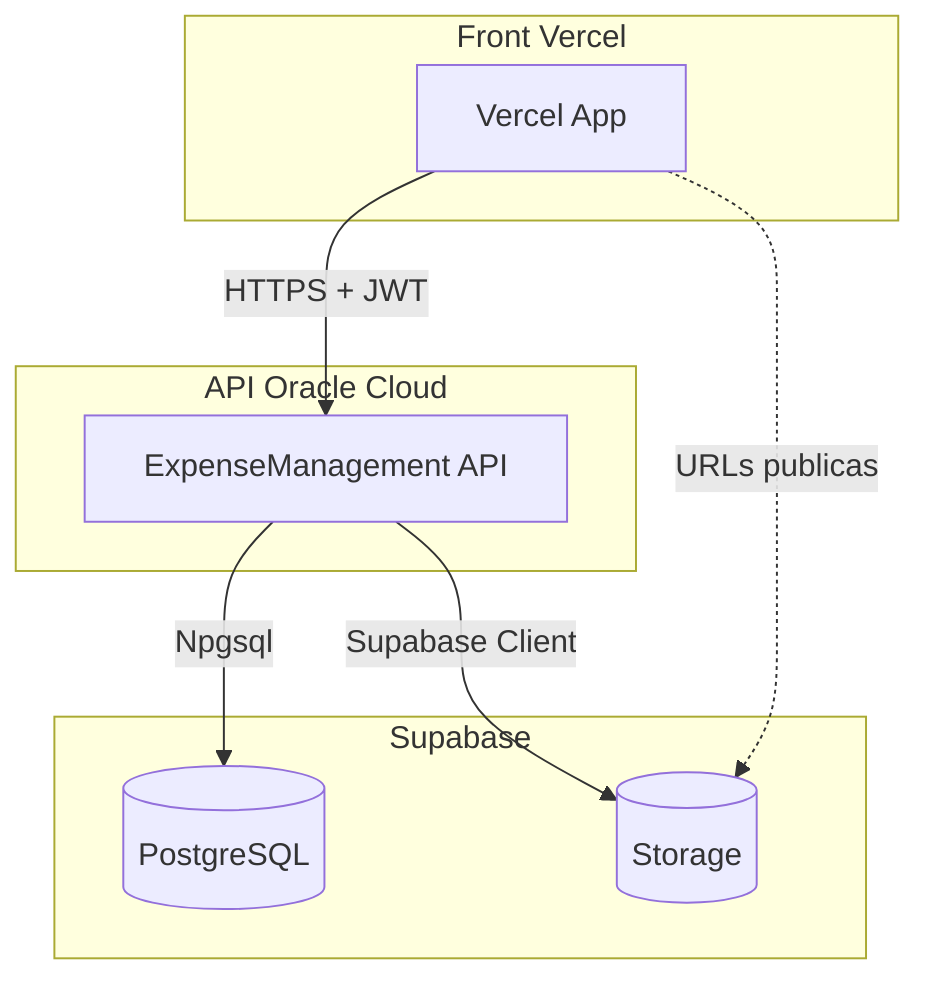

# Plano: Deploy API (Oracle) + Front (Vercel) + Supabase

## 1. Novo escopo do projeto


| Componente             | Infraestrutura     | Observação                      |
| ---------------------- | ------------------ | ------------------------------- |
| **API**                | Oracle Cloud (OCI) | Deploy em container ou VM       |
| **Front**              | Vercel             | SPA ou SSR conforme arquitetura |
| **Banco de dados**     | Supabase           | PostgreSQL (manter Npgsql)      |
| **Storage de imagens** | Supabase Storage   | Substituir `wwwroot/uploads`    |


**CORS e AllowedHosts:** via variáveis de ambiente (sem alteração de código necessária para a lógica).

---

## 2. Verificação do Swagger

**Situação atual:** O Swagger está **exposto em todos os ambientes**.

Em [ExpenseManagement/Program.cs](ExpenseManagement/Program.cs) (linhas 229-241):

```csharp
if (app.Environment.IsDevelopment())
{
    app.UseSwagger();
    app.UseSwaggerUI(...);
}
else
{
    // Comentário diz "proteger Swagger" mas o código faz o mesmo!
    app.UseSwagger();
    app.UseSwaggerUI(...);
}
```

Ambos os blocos habilitam Swagger. O README indica que em produção o OpenAPI exige autenticação, mas **não há implementação** dessa proteção.

**Ação recomendada:** Desabilitar Swagger em produção ou protegê-lo com autenticação (ex.: `MapSwagger().RequireAuthorization()` ou verificação de header/env específico).

---

## 3. Adaptação para Supabase Storage

### 3.1 Estado atual do upload

- [ImageUploadService.cs](ExpenseManagement/Services/ImageUploadService.cs) grava em disco local (`wwwroot/uploads/expenses`).
- URL retornada: `/uploads/expenses/{fileName}` (relativa); a API monta URL absoluta com `PublicBaseUrl`.
- Método `DeleteExpenseImageAsync` remove arquivo do disco.

### 3.2 Alterações necessárias


| Arquivo                                                                   | Alteração                                                                         |
| ------------------------------------------------------------------------- | --------------------------------------------------------------------------------- |
| [ExpenseApi.csproj](ExpenseManagement/ExpenseApi.csproj)                  | Adicionar pacote `supabase` ou `Supabase.Storage`                                 |
| [ImageUploadService.cs](ExpenseManagement/Services/ImageUploadService.cs) | Implementar `IImageUploadService` usando Supabase Storage em vez de disco         |
| [Program.cs](ExpenseManagement/Program.cs)                                | Registrar cliente Supabase e injetar config (Url, AnonKey/ServiceKey)             |
| `appsettings*.json`                                                       | Seção `Supabase` com `Url`, `StorageBucket`, `AnonKey` (ou variáveis de ambiente) |


### 3.3 Fluxo Supabase Storage

1. Criar bucket `expense-images` (ou similar) no Supabase Dashboard.
2. Usar `Storage.From("expense-images").Upload(file)` para upload.
3. Obter URL pública via `Storage.From("expense-images").GetPublicUrl(path)` ou `CreateSignedUrl` se quiser URLs temporárias.
4. No delete: `Storage.From("expense-images").Remove(paths)`.

### 3.4 URLs retornadas

- Atual: `{PublicBaseUrl}/uploads/expenses/{fileName}` (arquivo servido pela API).
- Com Supabase: URL direta do Storage, ex.: `https://{project}.supabase.co/storage/v1/object/public/expense-images/{path}`.

O frontend e a lógica de exibição precisam aceitar URLs absolutas externas (já comum para imagens).

---

## 4. Melhoria dos testes unitários

### 4.1 Cobertura atual


| Arquivo                                                                             | Testes    | Cobertura                         |
| ----------------------------------------------------------------------------------- | --------- | --------------------------------- |
| [ExpenseServiceTests.cs](ExpenseManagement.Tests/Services/ExpenseServiceTests.cs)   | 15 testes | ExpenseService (CRUD, validações) |
| [AuthServiceTests.cs](ExpenseManagement.Tests/Services/AuthServiceTests.cs)         | 4 testes  | Login, claims, erros              |
| [CategoryServiceTests.cs](ExpenseManagement.Tests/Services/CategoryServiceTests.cs) | 10 testes | Categoria CRUD e validações       |


### 4.2 Lacunas identificadas

- **ImageUploadService**: sem testes.
- **Repositories** (ExpenseRepository, CategoryRepository): sem testes.
- **Controllers** (ExpenseController, AuthController, CategoryController): sem testes de integração ou unitários.
- **ExceptionMiddleware**: sem testes.

### 4.3 Melhorias sugeridas

1. **ImageUploadServiceTests**
  - Mock de `Supabase.Client` ou interface `IStorageClient`.
  - Testar: upload com arquivo válido retorna URL; rejeitar tipos inválidos; delete quando URL é do bucket.
2. **ExpenseRepositoryTests** (com `InMemory` ou SQLite em memória)
  - Paginação, filtros, ordenação, busca por `EF.Functions.Like`.
3. **ExpenseControllerTests** (WebApplicationFactory ou mocks)
  - Upload: validação de arquivo, retorno de URL.
  - Delete de imagem, CRUD de despesas.
4. **AuthControllerTests**
  - Register, Login, Refresh com mocks de UserManager.
5. **ExceptionMiddlewareTests**
  - `BusinessException` → 400, `UnauthorizedAccessException` → 401, exceção genérica → 500.

---

## 5. Configuração via variáveis de ambiente

Variáveis sugeridas para o novo escopo:


| Variável                               | Uso                     | Exemplo                                             |
| -------------------------------------- | ----------------------- | --------------------------------------------------- |
| `ConnectionStrings__DefaultConnection` | Supabase PostgreSQL     | `postgresql://...@db.xxx.supabase.co:5432/postgres` |
| `Supabase__Url`                        | URL do projeto Supabase | `https://xxx.supabase.co`                           |
| `Supabase__AnonKey`                    | Chave anônima (Storage) | `eyJ...`                                            |
| `Supabase__StorageBucket`              | Nome do bucket          | `expense-images`                                    |
| `Cors__AllowedOrigins`                 | Origens CORS (Vercel)   | `https://seu-app.vercel.app`                        |
| `AllowedHosts`                         | Hosts permitidos        | `seu-app.vercel.app;api.seudominio.com`             |
| `PublicBaseUrl`                        | URL pública da API      | `https://api.seudominio.com`                        |
| `ServiceUri__ExpenseApi`               | URL da API (front)      | `https://api.seudominio.com`                        |


---

## 6. Diagrama da arquitetura final




---

## 7. Ordem de implementação sugerida

1. **Swagger:** Desabilitar ou proteger em produção em [Program.cs](ExpenseManagement/Program.cs).
2. **Supabase Storage:** Implementar `SupabaseImageUploadService` e substituir o serviço atual; configurar variáveis.
3. **Testes:** Adicionar `ImageUploadServiceTests`, depois expandir para Repositories e Controllers.
4. **Deploy:** Ajustar Dockerfile e variáveis de ambiente para OCI, Vercel e Supabase.

